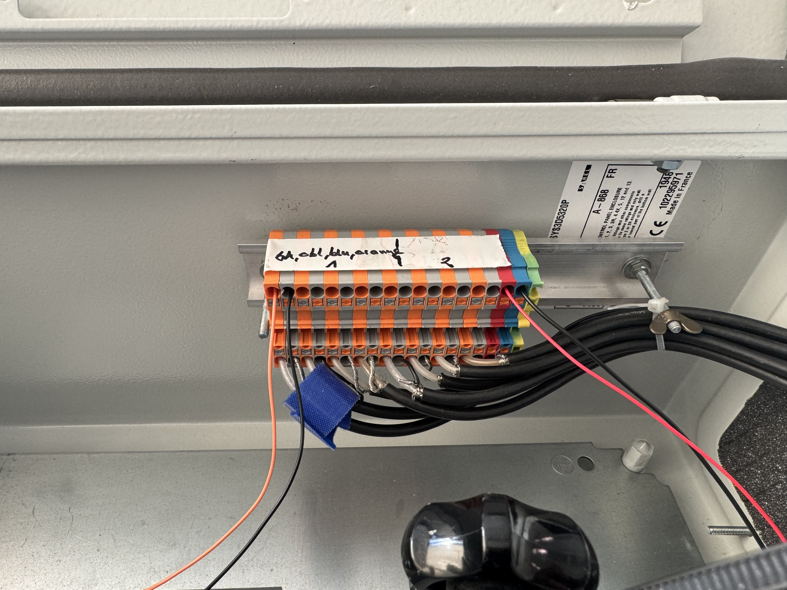

# Mycelium UV Excitation Response Lab Setup

This repository contains the automation and data acquisition script used to record the extracellular electrical response of mycelium when stimulated by a UV light pulse. 

The system uses a **Digilent Analog Discovery Pro (ADP)** to send precise digital pulses and receive multi-channel analog logging from inside a shielded Faraday box.


## Hardware Architecture & Specifications

### 1. Excitation Source (UV Flashlight)
* **Type:** 10W High-Power UV Flashlight
* **Electrical Requirement:** 3.6V Lithium-Ion Battery (~2.77 Amps peak draw)
* **Control Mechanism:** Controlled via an external Electronic Switch. 
  * *Note:* The Digilent Digital I/O pins output a maximum of 16mA and cannot power the lamp directly. The Digilent DIO pin acts strictly as a signal trigger to close the external switch circuit, utilizing the flashlight's internal battery for raw current.

### 2. Biological Setup (Inside Faraday Box)
* **Substrate:** One agar Petri dish containing active mycelium growth. For detailed growth manual [Mycelium on Agar substrate growth manual](Inoculation_on_agar_substrate.pdf). And One reference agar Petri dish without mycelium for GND measurements. 
* **Active Electrode (Scope CH1 and CH3):** Placed directly in the mycelium mass, targeted by the UV light beam.
* **Reference/Ground Electrode (Scope CH1 and Scope CH3 Ground)**


##  Pinout & Terminal Strip Wiring Diagram

| Terminal Row | Target Component Connection | Digilent Device Connection | Function |
| :--- | :--- | :--- | :--- |
| **Row 1** | Active Electrode| **Scope CH1 (+)**  | Mycelium Signal Recording |
| **Row 2** | Reference Electrode | **Scope CH1 (-)** | Mycelium Ground Baseline |
| **Row 17** | External Relay Trigger (`IN`) | **DIO 0** (Digital Pin 0) | UV Pulse Control Signal |
| **Row 18** | External Relay Ground (`GND`) | **Digital GND** | Digital Ground Return |



You can also add electrodes in different scopes for multiple electrodes recording. 

## Software & Script Logic

### Execution Workflow:
1. **Hardware Initialization**: Connecting to the Digilent hardware via the WaveForms SDK (dwf), arming the Analog Input Channels to the configured voltage range, and initializing DIO 0 to LOW (0V).

2. **Baseline & UV Activation**: Launching oscilloscope recording to collect baseline data in the dark. Once the baseline time elapses, firing a 100 ms HIGH trigger pulse on DIO 0 (and immediately returns it to LOW) to toggle the latching UV light ON.

3. **Exposure & Deactivation**: Monitorong the clock in real-time during the UV exposure window. When the exposure period ends, firing a second 100 ms HIGH trigger pulse on DIO 0 (returning to LOW) to toggle the UV light OFF.

4. **Recovery Recording**: Continuing to record the mycelium's electrical recovery in total darkness for the remaining duration while DIO 0 sits idle at 0V.

5. **Data Processing & Visualization**: Completing data collection, compiling the recorded streams into data arrays (saving .npy binaries), and generating a time-series graph mapping the UV Exposure Window vs. Fungal Response.


## How to Run the Experiment

### 1. Clone the Repository
Open your terminal or command prompt, navigate to your desired working directory, and clone this project:

```bash
git clone [https://github.com/seomii/mycelium.git]
cd mycelium
```

### 2. Prerequisites
Ensure you have the Digilent WaveForms Application and Runtime SDK installed on your OS environment.
#### Install Python Dependencies
```bash

pip install numpy matplotlib

```

## Running the Test
- Verify all physical wire lines match the Terminal Block Layout listed above.

- Secure the Faraday box enclosure to shield the microvolt-level fungal signals from ambient EM noise.

- Execute the script


The console will display real-time tracking updates:
Elapsed recording time: 30 / 120 seconds...

Upon completion, a Matplotlib window will automatically render your data curves, and the raw numpy binary arrays (mycelium_electrode_response.npy and uv_pulse_verification.npy) will save directly to your repository folder.